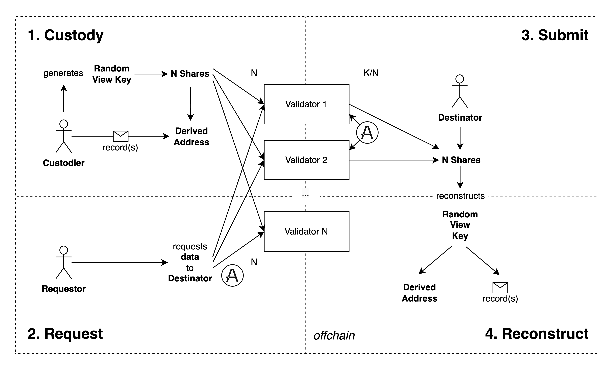

# Aleo DCP: Data Custody Protocol

A decentralised MPC protocol built on Aleo to **allow any program to custody arbitrary private data** that can be transactionally withdrawn.

Data is splitted following **Shamir Secret Sharing (SSS)** algorithm. Shares are custidied by Validators, that can be dynamically updated through a voting gouvernance mechanism. They are incentivized with **Aleo credits fees** paid by requester of custodied data.

## Use Cases

**Aleo DCP** enables use cases such as decentralised data broker or private data NFT marketplace with one click buy.

## How it works?

### General idea

The protocol allows any program to privately hold a `field` element and distribute it transactionally. It can be used to store:

- A View Key protecting record(s) hence storing arbitrary data.
- A `field` directly, allowing addition updates on stored data by leveraging additive homomorphic properties of SSS.

### Custodying arbitrary record data

Protocol enables programs to hold and distribute data stored in any arbitrary record:

1. Record from any program containing the private data is transferred to an address, which View Key (generated randomly) is splitted in shares among N validators using Shamir Secret Sharing algorithm. This is the **Custody** step.
2. This view key can later be requested to be sent privately to any destination address, by initial program. This is the **Request** step.
3. A decentralized network of [validators](#validators) can then process the query immediatly. It consists of peers running bot JS script, that provide their respective share to the destination address. This is the **Submit** step.
4. The requestor can then reconstruct the View Key offchain using k of n shares and decipher the private data from the original record. This is the **Reconstruct** step.

**Request**, **Execute**, and **Submit** step can all happen without awaiting validation from the original caller of **Custody** step transaction.



### Additive homomorphic operations support

**Custody** step can be call multiple times, with the same `custody_id`, by a program that imports DCP. In that case, shares associated with custodied `field` elements must simply be added by validators before being submitted to destinator.

## Protocol Governance

### Validators

Protocol has **a set of Validators** and a **vote threshold**, initiated by deployer, which can be updated through a voting mechanism.

Validors role is to custody data shares and process queries.

It supports any maximum amount of validators decided on deployment of protocol programs.

Validators propose and vote for **Proposals**, consisting of a new set of Validators and next vote threshold.

[Check implementation of gouvernance in **`protocol_core.leo`**.](programs/protocol_core/src/main.leo)

### Run a Validator

Incoming Javascript implementation.

**`validator/run.js`**: TODO.

### Governance DApp UI

Incoming React frontend application built with `aleo-wallet-adapter` package. It is made for validators to manage Governance of the protocol.

**`validator/ui`**: TODO.

#### Features

- Initiate a new **Proposal**.
- Vote for any exisiting **Proposal**.

## Usage

### How to call it from any Aleo program?

#### For arbitrary record data

For a program to custody private data, it must import **`data_custody_protocol.aleo`**.

1. To custody data, it must:
    - Call `data_custody_protocol.aleo/custody_data_as_program((data_view_key as field), threshold, ...)`
    - Send any records to `(data_view_key * group::GEN) as address`
2. It can then call `data_custody_protocol.aleo/request_data_as_program` to initiate a data request.
3. Validator bots automatically call `protocol_transfers.aleo/process_request_as_validator` to accept the data request.
4. `data_custody_protocol.aleo/assert_completed_as_program` can then be used by the program to check if data was effectively transmitted.

#### Multiple Custody steps

In case **Custody** step was called more than once for a single `request_id`:

Between step 3 and step 4, validator bots must call `protocol_transfers.aleo/join_shares_as_validator` as many time as there are additional **Custody** step.

### Example

An obvious use case for the protocol is a Marketplace Program for exchanging NFTs with secret data. A standard proposal for such NFTs is detailed at [**`arc721_example.leo`**](/examples/nft_marketplace/programs/arc721_example/src/main.leo).

[Check implementation of marketplace in **`marketplace_example.leo`**](/examples/nft_marketplace/programs/marketplace_example/src/main.leo)

Here are interactions with the protocol snippets:

```rust
import data_custody_protocol.aleo;
import arc721_example.aleo;
import credits.aleo;

program marketplace_example.aleo {
    const mpc_threshold: u8 = 8u8;

    ...

    async transition list(
        ...
        private secret_random_viewkey: scalar,
        private privacy_random_coefficients: [field; 15],
        private validators: [address; 16],
    ) -> (NFTView, Future) {
        ...

        let secret: field = secret_random_viewkey as field;
        let nft_data_address: address = (data_view_key * group::GEN) as address;

        let custody_id: field = BHP256::hash_to_field(nft_data_address);

        let data_custody: Custody = Custody {
            initiator: self.caller,
            custody_id: custody_id,
            threshold: mpc_threshold,
        };

        let data_custody_hash: field = BHP256::hash_to_field(data_custody);

        let custody_data_as_program_future: Future =
            data_custody_protocol.aleo/custody_data_as_program(
                secret, // private secret : field,
                custody_id, // private custody_id: field,
                privacy_random_coefficients, // private coefficients: [field; 15],
                validators, // private validators: [address; 16],
                mpc_threshold // private threshold: u8 <= 16
            );

        let list_future: Future = finalize_list(
            ...
            custody_data_as_program_future
        );
        ...
    }
    async function finalize_list(
        ...
        custody_data_as_program_future: Future
    ) {
        custody_data_as_program_future.await();
        ...
    }

    /*
        Validators associated with the listing can be retrieved offchain using: 
            protocol_core.aleo/validator_sets.get(
                protocol_core.aleo/custodies.get(
                    listing_data.data_custody_hash
                )
            )
    */
    async transition accept_listing(
        ...
        public validators: [address; 16],
        public validator_fee: u64,
        private protocol_fee_record: credits.aleo/credits
    ) -> (credits.aleo/credits, Future) {
        ...
        let custody_id: field = BHP256::hash_to_field(listing_data.nft_data_address);
        let (
            change,
            request_data_as_program_future
        ): (
            credits.aleo/credits,
            Future
        ) =
            data_custody_protocol.aleo/request_data_as_program(
                custody_id, // private custody_id: field,
                self.signer, // private to: address,
                mpc_threshold, // private threshold: u8,
                validators,// public validators: [address; 15],
                validator_fee,
                protocol_fee_record,
            );
        let accept_listing_future: Future = finalize_accept_listing(
            ...
            request_data_as_program_future,
        );
        ...
    }
    async function finalize_accept_listing(
        ...
        request_data_as_program_future: Future
    ) {
        ...
        request_data_as_program_future.await();
    }


    // {nft_data, nft_edition} are retrieved by executing 'reconstruct_secret.aleo' offchain on shares sent to buyer by validators
    async transition withdraw_nft(
        nft_data: data,
        nft_edition: scalar,
        ...
    ) -> (arc721_example.aleo/NFT, Future) {
        ...
        let (
            purshased_nft,
            transfer_nft_to_buyer_future
        ): (arc721_example.aleo/NFT, Future) = arc721_example.aleo/transfer_public_to_private(
            nft_data,
            nft_edition,
            self.caller,
        );
        let accept_listing_future: Future = finalize_withdraw_nft(
            ...
            transfer_nft_to_buyer_future,
        );
        return (
            purshased_nft,
            accept_listing_future
        );
    }
    async function finalize_withdraw_nft(
        ...
        transfer_nft_to_buyer_future: Future,
    ) {
        ...
        transfer_nft_to_buyer_future.await();
    }
}
```

*This is a very simplified marketplace to focus on the **`data_custody_protocol.aleo`** program usage. This is why seller/buyer privacy as well as offers are not implemented here.*

## Future Improvements

- **Idea 1:** Allow any amount of data requests. The amount is set as an input of **Custody** step, and is reduced by one on **Request** step.
- **Idea 2:** Allow an array **Destinator** for the data (reduce by array length on **Request** step)
